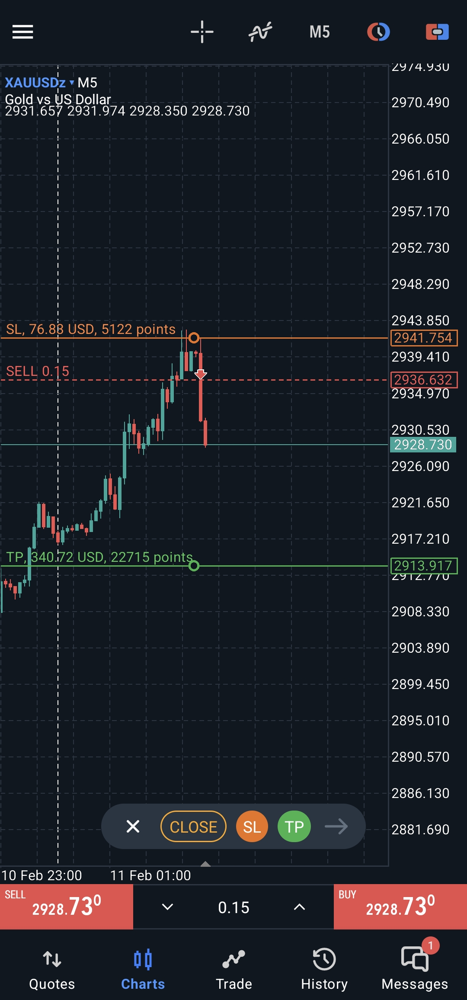
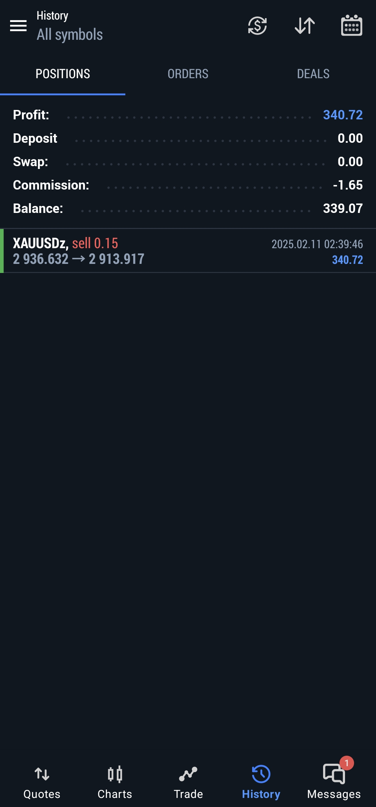

**Trade Logic:**  
- Two rejection wicks formed on the 5-minute timeframe.  
- Price then broke the low of the rejected wick candle as well as the bullish candle that followed the rejected red candle.  
- Entry was taken when the low was broken.  
- It was a good trade, but more on the impulsive side.  
- I trailed the stop-loss (SL) over time to avoid a reversal, securing my breakeven and, at times, extending for a 1:2 profit target to let the winner run longer.
- High risk High reward type of trade 
- Strategy type : Failed candel 
-Tight SL is perfer in this type of trade
