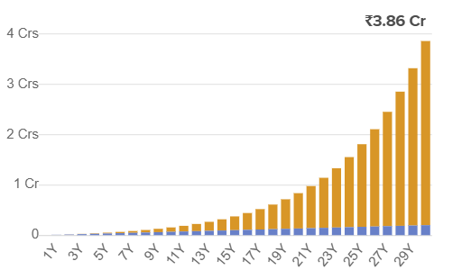

# 📅 Investment Journal: "Starting SIP in Siddharth Capital"

**Date:** 2021 July
**Investment Amount:**  
- **Initial Investment:** NPR 3000/month (First few months)  
- **Increased Investment:** NPR 5500/month (From 4th month)  
**Frequency:** Monthly  
**Objective:** Long-term wealth creation, financial stability, passive income post-retirement  

---

### **💡 Motivation for Investment:**
1. **Wealth Creation:** Build significant wealth over time with the power of compounding.  
2. **Financial Stability:** Secure a stable financial future through disciplined investing.  
3. **SIP Benefits:** Invest a fixed monthly amount in mutual funds, reducing risks and averaging costs.

---

### **🏦 Why Siddharth Capital?**
- **Reputable & Reliable:** Trusted fund house with a good track record.  
- **User-Friendly Platform:** Convenient KYC process, SIP setup, and investment monitoring online.

---

### **📝 Investment Process:**
1. **Registration:** Signed up on Siddharth Capital’s website (provided name, email, phone, address, Meroshare details).  
2. **KYC Verification:** KYC completed within a few days.  
3. **Investment Setup:** Chose mutual funds and set up SIP plan.

---

### **💸 Investment Journey:**
- **Initial SIP:** Started with NPR 3000/month for the first few months.  
- **Adjusted SIP:** Increased to NPR 5500/month from the 4th month.  
- **Challenges:** Financial difficulties delayed the 7th installment.

---

### **📊 Challenges & Learnings:**
- **NAV Understanding:** Gained insight into mutual fund performance and NAV.  
- **Realistic Expectations:** Set realistic goals while managing market fluctuations.  
- **Discipline:** Sticking to the plan despite volatility is key to long-term success.

---

### **🎯 Goals:**
1. **Return Target:** 15% per annum returns over 30 years.  
2. **Passive Income:** Generate income post-retirement.  
3. **Stock Market Learning:** Improve investment strategies for smarter decisions.

---

### ** Charts:**
| **Metric**                   | **Amount (NPR)**           |
|------------------------------|----------------------------|
| **Expected Future Value**     | **NPR 3,85,54,013.33**     |
| **Total Amount Invested**     | **NPR 19,80,000.00**       |
| **Expected Total Gain**       | **NPR 3,65,74,013.33**     |
