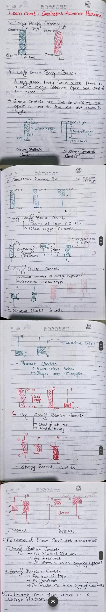

# 1. Long Body Candles
Long body candlesticks indicate strong momentum and significant price movement within the trading session. They suggest a strong trend in the direction of the candle's body.

# 2. Long Green Body - Bullish
A long green body forms when there is a wide range between the open and close of the price. This type of candlestick typically indicates a strong bullish sentiment.

**Strong Candles**: These are characterized by the open being near the low and the close being near the high, signaling a strong upward movement.

# 3. Candlestick Analysis Pro

## Very Strong Bullish Candles
- **Closing at High**: The candle closes at or near its high, indicating strong bullish pressure. (closing == high)
- **Wide Range Candles**: A large difference between the open and close, reflecting strong buying activity during the session.

## Strong Bullish Candles
- **Small Amount of Selling Pressure**: There might be some selling, but it is not enough to outweigh the buying pressure.
- **Sometimes Narrow Range**: The candle range can be narrow, but the bullish sentiment still dominates.

## Neutral Bullish Candles
- **Mild Bullish Sentiment**: The price moves upwards, but the momentum is weaker compared to strong bullish candles.
- **Close Above Open**: The close is higher than the open, indicating upward movement, but the candle body is not as large or convincing as a strong bullish candle.

