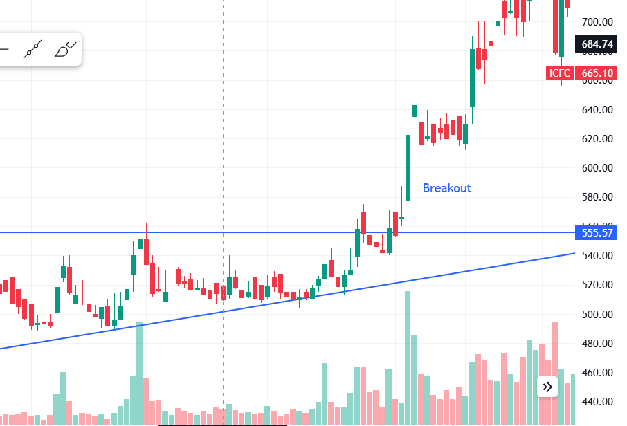

# 📖  Mastering Failed Breakouts & Understanding Retail Traps

> **Exploring why breakouts often lead to disappointment in trading and why retailers find themselves stuck.**

---

## 🔍 **What is a Breakout?**

A **breakout** occurs when the price of an asset moves beyond significant support or resistance levels, often suggesting the beginning of a new trend.

---

## ❌ **Reasons for Failed Breakouts**

1. **🛑 False Breakout**  
   - Breakouts that initially appear promising can be false signals.

2. **⚠️ Lack of Confirmation**  
   - Breakouts should ideally be confirmed by volume or other indicators.

3. **📉 Whipsaw Price Action**  
   - Market volatility can cause whipsaw price action, where the price moves rapidly in both directions.

4. **🔒 Stop-Loss Placement**  
   - Retailers often place stop-loss orders just below the breakout point.  
   - Institutional traders may exploit these orders, triggering them before price resumes its intended direction.

5. **🎭 Market Manipulation**  
   - Large players may manipulate prices to trap retailers through artificial price moves.

---

## 🚩 **Why Retail Traders Get Trapped**

1. **📉 Fear of Missing Out (FOMO)**  
2. **📘 Lack of Experience**  
3. **💔 Emotional Trading**  
4. **💰 Over-Leveraging**

---

## 💡 **Key Takeaways**

- Breakouts not working and traders getting stuck is a common scenario in trading.  
- To handle breakouts effectively, traders should:  
  - Be cautious with risk.  
  - Use indicators to confirm breakouts.  
  - Avoid making hasty decisions driven by emotions.

---

### **📚 Learning Points**  
- Gaining experience and being disciplined in trading is crucial.  
- Learning to manage losses when breakouts fail is key to long-term success.  
- **"Stay calm, adapt, and grow with each trade."**
