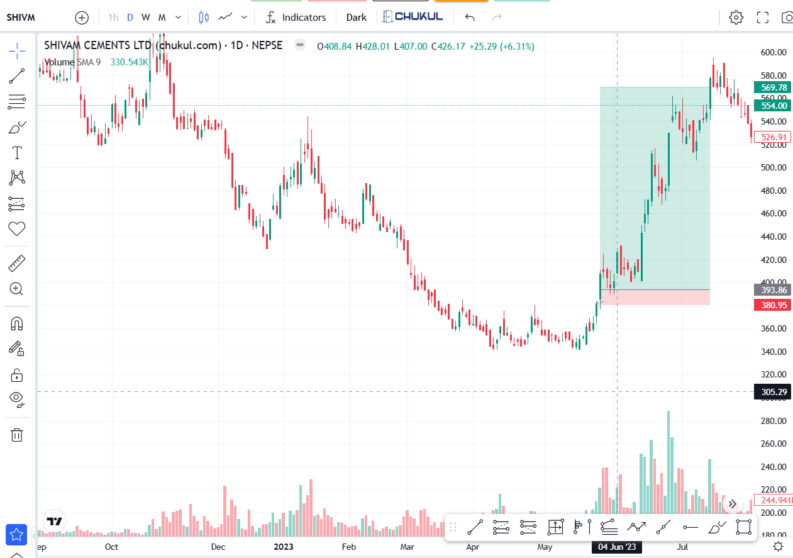

# 🏆 **Trade : SHIVM**

**📈 Instrument:** TMS14, SHIVM (Manufacturing & Production)  
**📍 Entry:** 395  
**🚪 Exit:** 565  
**🔢 Quantity:** 400  
**💰 Profit:** 84,000  
**⏳ Duration:** [ ]  
**✅ Status:** Successful  
**🔒 Stop Loss:** Initially 380 (I don't plan SL at all)  
**🔄 Trailed SL:** 580  

---

### 🔍 **Trade Analysis:**

The chart shows that SHIVM is in a downtrend, indicated by the lower lows (LL) and lower highs (LH). I observed a previous bullish trend on SHIVM and noticed that the market, i.e., SHIVM, was at the low of the previous downtrend, which might be a good opportunity to catch. Then I saw a bullish candle appearing but not able to push the price, indicating that there are buyers at this level. The level 380 to 420 was a consolidated level forming a bullish rectangle. Initially, my target was 480, but I trailed my stop loss and kept holding. I wanted to hold until the trend, but I couldn’t do so because I bought other stocks and had to pay for them. Finally, I sold it on **18 June 2023**.

I was successful in this trade but couldn’t extract maximum profit because I ran out of buying more stocks, which caused me to sell it before my actual plan.

- **Exit Strategy Adjustment:**  
  Initially, my target was 480. However, as the price continued to rise, I adjusted by trailing my stop loss to 580 to lock in more profit. Unfortunately, external factors caused me to sell earlier than planned, as I needed liquidity for other stock purchases. I exited on **June 18, 2023**, with a profit of **84,000**.

- **Missed Potential:**  
  Although the trade was profitable, I couldn't maximize the full potential because of the premature exit caused by liquidity needs.

---

### 🧠 **Review and Learning:**

#### **📚 Lesson from the Trade:**
- **Timing & Market Patterns:**  
  Recognizing the **consolidation zone** and the **bullish candle** at key support gave a strong **entry signal**, and trailing the stop loss allowed me to **capture more profit** as the trend continued.

- **Adaptability:**  
  I adapted well by **trailing my stop loss**, which helped me capture additional profit as the trend developed further, despite not reaching my initial target.

---

#### **⚠️ Area for Improvement:**
- **📊 Sticking to the Exit Plan:**  
  I deviated from my exit strategy because of external factors (needing capital for other stocks). To improve, I need to stay disciplined with my exit plan and avoid letting external pressures dictate my trading decisions.
  
- **💡 Liquidity & Position Management:**  
  I need to focus more on **capital management** to ensure I have enough liquidity for all positions without the need to exit profitable trades prematurely. This could be done by better **position sizing** and having a more **robust portfolio strategy**.

---

**🔑 Key Takeaway:**  
This trade emphasized the importance of **discipline** in adhering to my trading strategy, and also highlighted the need for **stronger capital management** to prevent external factors from influencing my decisions. **Consistency** in execution and **liquidity management** will be crucial for maximizing profits in future trades.
