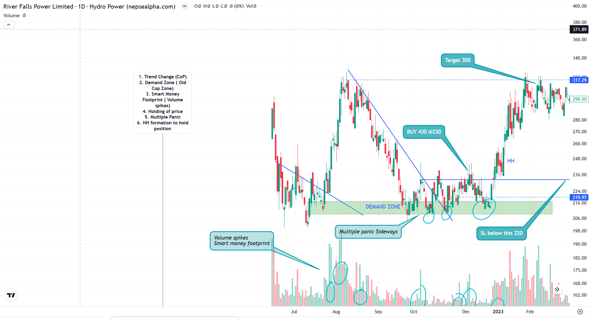
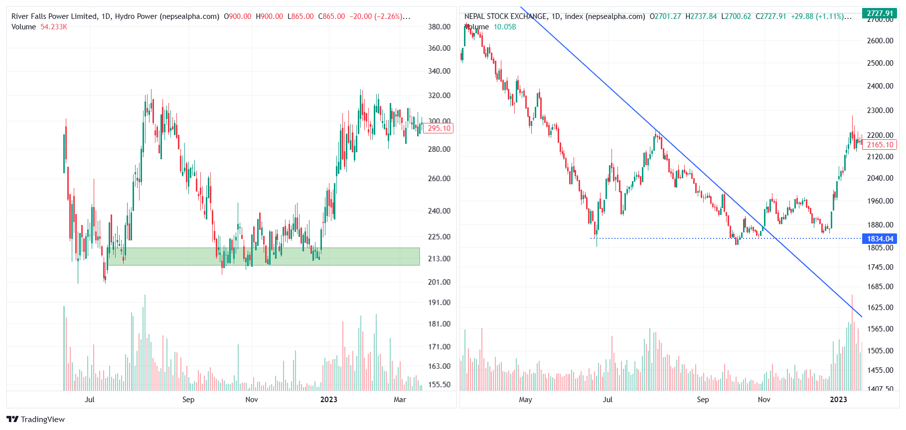

### **📝 Trade Records**

- **Script:** `RFPL`  
- **Market:** `Nepse`  
- **Details:**
  - **Entry Price:** ₹230 *(Total: ₹98,803.83)* 💵  
  - **Exit Price:** ₹315 💰  
  - **Profit/Loss:** ₹32,791 *(after ₹2,658 tax deduction)* 📈  
  - **Stoploss:** ₹200  
    > *(Triggered after the swing low break at ₹12,900. Note: The market briefly broke support—awaiting weekly close confirmation.)* 🚫  
  - **Position Size:** 430 shares 📊  
  - **Direction:** 🟢 **Long** ➡️  

---

### **📈 Pattern Analysis**

📌 **Key Chart Reference:**  

---

### **🛠️ Trade Setup**

**✨ Why I Took This Trade:**  
1. **Smart Money Footprint:** The price rapidly spiked from this point, rallying 50%—a clear sign of smart money activity.  
2. **Volume Surge:** Trading volume spiked significantly compared to the average during the rally.  
3. **Demand Zone Entry:** I waited for the price to reach the demand zone and entered as it broke the previous high.  
4. **Strong Support:** The price held in the demand zone despite multiple breakout attempts.

**🔍 Conviction Factors:**  
1. **Trend Change (CoP):** The zone where sellers turn into buyers (a shift in polarity).  
2. **Demand Zone:** Recognized as the former CoP zone.  
3. **Smart Money Footprint:** Confirmed by noticeable volume spikes.  
4. **Price Consolidation:** Stable price action within the demand zone.  
5. **Multiple Panic Sells:** Indicated market overreaction, hinting at a reversal.  
6. **Higher High Formation:** Demonstrated strong upward momentum.

---

### **🌐 Market Condition**

- **Market Sentiment Description:**  
    
  - The market was transitioning into a bullish phase. While Nepse moved sideways after the **Wave G drop**, RFPL maintained its price in the demand zone, trading sideways for 3 months (90 days).  
  - **Observation:** NEPSE continued its upward trend forming higher lows, whereas RFPL exhibited relatively equal lows despite multiple volume spikes.

---

### **💭 Emotional Reflection**

- **😬 During the Trade:**  
  - Frequent red candles, despite higher highs, triggered *fear and impatience*.  
  - The sideways price movement led to confusion and anxiety, yet RFPL's relative strength compared to Nepse bolstered my confidence.
- **😔 After the Trade:**  
  - I felt *happy* after booking profits.  
  - The market corrected upon reaching the target zone before returning to the demand zone.

---

### **⚠️ Mistakes or Deviations**

- **✅ Did I Follow My Trading Plan?**  
  - Yes, though my entry could have been executed earlier after the trendline breakout to secure a better risk-reward ratio. While the delay wasn’t critical, timely entries are essential.

---
