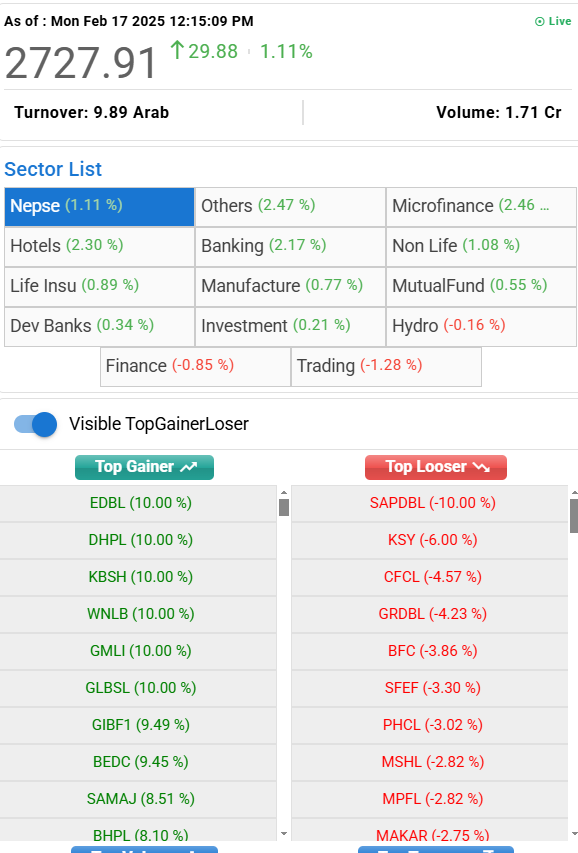
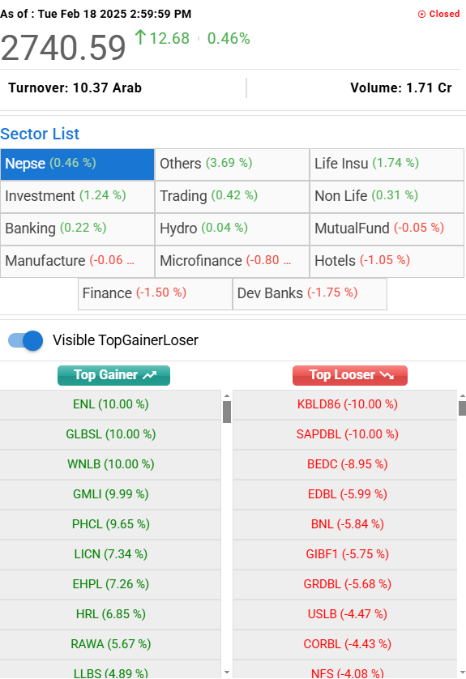

# **📊 WEEKLY NEPSE ACTIVITIES**  

---  

## **📅 DATE**  

  
  
  
    Year: 2025 AD (2081 BS)     
    Month: FEB (Magh/Fagun)      
    Date Range: 2025 FEB 16 – FEB 20 (2081 Fagun 4 -Fagun 8)     
  
  
  
  
      
  
  

  

---  

## **📈 NEPSE Overview**  

| **DATE**        | **NEPSE INDEX**  | **MARKET VOLUME** | **TOP SECTORS** | **KEY OBSERVATIONS** | **CHUKUL SUMMARY** |**CHART** |  
|-----------------|---------------|----------------|----------------|---------------------------------------------|--------------------|-----------|  
| **Feb 16 (Sun)** | **2698.03 (+19.56) (+0.73%)** 🔼 | **9.47 Arab**  |Finance, Hotels, Microfinance |Overall all index perform well as i expected but Non Life was negative.||  |
| **Feb 17 (Mon)** | **2727.91 (+29.88) (+1.11%)** 🔼 | **10.05 Arab**  |Microfinance, Banking, Mixed |Overall all index perform well but finance and hydro face some correction.During the closing there is a small selling present. Initially the finace was postivie but later it face some selling. Almost every hours the market was positive not such unusual selling or anythings that is noticed.Today the volume was above 10 arab which indicate for the rise of high cap companies.||  |
| **Feb 18 (Tue)** | **2740.59 (+12.68) (+0.46%)** 🔼 | **10.37 Arab**  |Others, Life Insurance, Investment |Today, Initally all index were positive but slowly the selling started. Finance, Dev Bank and Hotels have higher correction where other indexes like microfinance, hydro are slightly corrected.||  |
  

---  

## **💭 TRADING THOUGHTS & MARKET REALITY**  

| **DATE**  | **EXPECTATION**                                | **WHAT HAPPENED?**                                   | **PORTFOLIO IMPACT** | **GAIN/LOSS** | **PORTFOLIO STATUS** | **NEPSE STATUS** |  
|-----------|-----------------------------------------------|-----------------------------------------------------|----------------------|--------------|----------------------|----------------|  
| **Feb 16** | Expected a bullish NEPSE and Finance | Most sectors give a Rally. NEPSE closed positive | MEHL closed higher; NYADI -ve circuit, causing concern and exit planning. BHPL also Negative; HHL performed well, breaking the higher high—extreme bullish. Gradually i increase my DHPL position size. | **+ 12345** |  | **Green** |
| **Feb 17** | Expected a bullish NEPSE  | Almost every sector was positive with high cap company was good. Most of Microfinance company hits circuit. | MEHL closed higher; NYADI was negative but i hope it will give me chances for full exit. BHPL hit positive circuit; HHL neutral, breaking the higher high—extreme bullish. Gradually i increase my DHPL position size, it hit circuit today but i add 100 kittas today. | **+ 32934** |  | **Green** |
| **Feb 18** | Expected a correction on NEPSE  | Almost every sector was positive with high cap company was good. Others secotr show extreme bullish | MEHL closed making inverted hammber, i booked my profit(full exit); NYADI was negative but i hope it will give me chances for full exit. BHPL hit positive circuit; HHL neutral, breaking the higher high—extreme bullish. DHPL hit cirucit within the minute of market open but faces correction and make a high wick doji candel. | **- 22742** |  | **Green** |

---  
---
## **📊 MY PORTFOLIO HOLDING**  

| **STOCK**  | **TREND**      | **EXIT PLAN**             | **NEW ENTRIES?** | **OBSERVATIONS**                | **CHART** | **HOLDING SIZE** |  
|------------|---------------|---------------------------|------------------|---------------------------------|-----------|------------------|  
| **MEHL**   | Holding HH/HL | FEB 18 I completely exit.    | ❌ No            | Forming higher highs.            | [📈 View Chart](https://nepsealpha.com/nepse-chart?symbol=MEHL) | Very High (> 10 Lakh) |  
| **BHPL**   | Holding HH/HL | Exit if swing breaks.     | ❌ No            | Tracking sector movement.       | [📈 View Chart](https://nepsealpha.com/nepse-chart?symbol=BHPL) | High (> 2 Lakh) |  
| **GCIL**   | Holding HH/HL | Exit if swing breaks.     | ❌ No            | In consolidation phase.         | [📈 View Chart](https://nepsealpha.com/nepse-chart?symbol=GCIL) | Average (≈ 1 Lakh) |  
| **HHL**    | Holding HH/HL | Exit if swing breaks.     | ❌ No            | Watching for a breakout.        | [📈 View Chart](https://nepsealpha.com/nepse-chart?symbol=HHL) | Average (≈ 1 Lakh) |  
| **NYADI**  | Weakening HH/HL | Exit if further decline.  | ❌ No            | Planning to exit and shift.     | [📈 View Chart](https://nepsealpha.com/nepse-chart?symbol=NYADI) | High (> 2 Lakh) |  

---
## **📌 WATCHLIST**  

### **🟠 Pre-Watchlist (Potential Opportunities)**  

| **STOCK**   | **SIGNAL TYPE**       | **NEW?** | **LOW CAP?** | **DEMAND ZONE RETEST?** | **TREND**      | **LAST UPDATED** | **CHART** |  
|-------------|-----------------------|----------|--------------|-------------------------|----------------|------------------|-----------|  
| **NICLBSL** | Change of Polarity    | ❌ No    | ❌ No        | ✅ Yes                  | 🔸 Weak HH & HL | Jan 27, 2025     |  |  

> *Click the icon to view the full chart.*  

### **🟢 Active Watchlist (Currently in Play)**

| **STOCK**   | **ENTRY STATUS**     | **RISK LEVEL** | **CURRENT MOVE**       | **CHART**  |
|-------------|----------------------|----------------|------------------------|------------|
| **MEHL**    | ✅ Exited           | Medium         | Might take some correction.   | [📈 View Chart](https://nepsealpha.com/nepse-chart?symbol=MEHL) |
| **BHPL**    | ⚠️ Still Watching    | High           | Sideways movement      | [📈 View Chart](https://nepsealpha.com/nepse-chart?symbol=BHPL) |
| **GCIL**    | ✅ Entered           | Low            | Consolidation phase    | [📈 View Chart](https://nepsealpha.com/nepse-chart?symbol=GCIL) |
| **NYADI**   | ✅ Tight SL          | High           | Correction over and Possible new rise comming | [📈 View Chart](https://nepsealpha.com/nepse-chart?symbol=NYADI) |
| **DHPL**   | ✅ Recently Entered  | Medium           | Breakout and Retest Correction and ranging not wants to decline further but holded price  | [📈 View Chart](https://nepsealpha.com/nepse-chart?symbol=DHPL) |

---  

## **📊 FRIDAY WEEKLY STATISTICS**  

Below is a side-by-side comparison of key metrics for NEPSE and my portfolio (2025 FEB 9 – FEB 13):  

| **METRIC**       | **NEPSE**         | **MY PORTFOLIO** |  
|-----------------|------------------|----------------|  
| **Market Days**  |    5            |          5  |  
| **Bullish Day**  |     Tue       |  Tue (Active Day) |  
| **Bearish Day**  |     Sun     |  Wed(Observed) |  
| **Top Gainer**   |     SAPDBL (18.97%)  | MEHL (9.71%)   |  
| **Top Loser**    |     ULBSL (-23.05%) | HHL(-2.89%)  |  
| **Volume Status** | Avg < 10 Arab   | N/A            |  
| **Point Change** | -9.84 (-0.37%)      | Avg Gain: Rs. 1 Lakh |  
| **Bullish Sector** | Finance, Dev Bank         | N/A            |  
| **Bearish Sector** | Manufacture, Hotels        | N/A            |  
| **Overall Trend** | Bearish         | Bullish (Profit in focus) |  

---  

## **🔍 WEEKLY INSIGHTS**  

- Market Sentiment: 

- Key Observation: 

- Trading Strategy:

- Possible Opportunity:

---

## **❔QUESTIONS**  
  - Why i completed exit MEHL ?
  - Why i add position on DHPL ?

---

