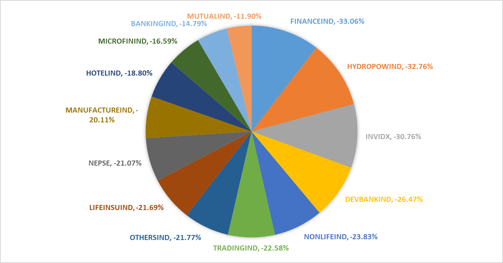
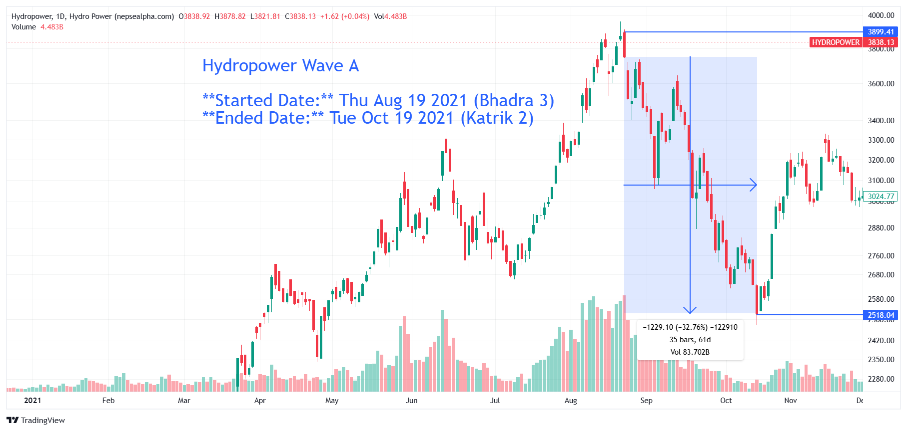

# NEPSE Wave A  

  

**Started Date:** Thu Aug 19, 2021 (Bhadra 3)  
**Ended Date:** Tue Oct 19, 2021 (Kartik 2)  

**Rally Type:** Drop  

- **Total Points Dropped:** -740  
- **Percentage Drop:** 23%  
- **Number of Bars:** 35  
- **Total Days:** 61  
- **Total Volume:** 277.8 B  

---

## Simple Statistics  

- **Average Volume per Bar:**  
  \( \frac{277.8}{35} = 7.94 \) B  

- **Average Drop per Bar:**  
  \( \frac{740}{35} = 21.14 \) points  

- **Recovery Rate After Drawdown:**  
  If the market drops by 23%, the required percentage increase from the bottom to recover fully is:  

  \[
  \text{Recovery Rate} = \left(\frac{1}{1 - 0.23} - 1\right) \times 100
  \]

  **≈ 29.87%**  

---

## Major News or Incidents During This Time  

- **Base Interest Rate:** *Insert details here*  
- **Policies:** *Insert policy-related changes*  

---

## Sector-wise Dissection  

### **Sector Performance During This Drop**  

| S.N | Symbol         | Close    | Prev Close | % Change  | Point Change |
|-----|--------------|----------|------------|-----------|--------------|
| 1   | FINANCEIND     | 2091.64  | 3124.58    | -33.06%   | -1032.94     |
| 2   | HYDROPOWIND    | 2522.18  | 3751.11    | -32.76%   | -1228.93     |
| 3   | INVIDX         | 81.95    | 118.35     | -30.76%   | -36.40       |
| 4   | DEVBANKIND     | 4509.52  | 6133.09    | -26.47%   | -1623.57     |
| 5   | NONLIFEIND     | 11255.10 | 14775.76   | -23.83%   | -3520.66     |
| 6   | TRADINGIND     | 2987.16  | 3858.24    | -22.58%   | -871.08      |
| 7   | OTHERSIND      | 1627.46  | 2080.46    | -21.77%   | -453         |
| 8   | LIFEINSUIND    | 14262.84 | 18213.42   | -21.69%   | -3950.58     |
| 9   | NEPSE          | 2510.73  | 3180.86    | -21.07%   | -670.13      |
| 10  | MANUFACTUREIND | 5964.91  | 7466.16    | -20.11%   | -1501.25     |
| 11  | HOTELIND       | 2927.51  | 3605.39    | -18.80%   | -677.88      |
| 12  | MICROFININD    | 4987.98  | 5979.85    | -16.59%   | -991.87      |
| 13  | BANKINGIND     | 1773.78  | 2081.63    | -14.79%   | -307.85      |
| 14  | MUTUALIND      | 14.81    | 16.81      | -11.90%   | -2           |

  

---

## Key Insights from Sector Performance  

1. **Finance and Hydro Suffered the Most:**  
   - The *Finance* sector had the largest drop (**-33.06%**), followed closely by *Hydropower* (**-32.76%**), indicating strong external pressures.  

2. **Market-Wide Sell-off:**  
   - The overall index (*NEPSE*) dropped **-21.07%**, suggesting a systemic decline rather than an isolated sector-specific correction.  

3. **Mutual Funds and Banking Were More Resilient:**  
   - The *Mutual Fund* sector saw the lowest decline (**-11.90%**), while *Banking* dropped **-14.79%**, indicating relative stability.  

4. **Higher Volatility in Small Sectors:**  
   - *Hydropower, Development Banks, and Finance* saw sharp declines, reflecting higher volatility in these industries.  

5. **Recovery Challenges:**  
   - A **23% drawdown** requires a **29.87% increase** to break even, emphasizing the difficulty of regaining losses in a bear phase.  

---

# **Finance Wave A - In-depth Analysis**  

  

**Started Date:** Thu Aug 19, 2021 (Bhadra 3)  
**Ended Date:** Tue Oct 19, 2021 (Kartik 2)  

**Rally Type:** Drop  

- **Total Points Dropped:** -1035  
- **Percentage Drop:** 33.14%  
- **Number of Bars:** 35  
- **Total Days:** 61  
- **Total Volume:** 33.56 B  

---

## Simple Statistics - Finance  

- **Average Volume per Bar:**  
    = 0.96  B  

- **Average Drop per Bar:**  
  = 29.57  points  

- **Recovery Rate After Drawdown:**  
  If the sector drops by 33.14%, the required percentage increase from the bottom to recover fully is:  

  **≈ 49.52%**  

---

## **Finance Wave A - Stock Performance**  

| S.N | Symbol | Close  | Prev Close | % Change | Point Change |
|-----|--------|--------|------------|----------|--------------|
| 1   | ICFC   | 571.43 | 985.71     | -42.03%  | -414.28      |
| 2   | PFL    | 500.00 | 832.69     | -39.95%  | -332.69      |
| 3   | GUFL   | 773.00 | 1282.00    | -39.70%  | -509.00      |
| 4   | CFCL   | 413.18 | 671.31     | -38.45%  | -258.13      |
| 5   | SFCL   | 408.00 | 660.00     | -38.18%  | -252.00      |
| 6   | NFS    | 465.00 | 742.00     | -37.33%  | -277.00      |
| 7   | SIFC   | 408.20 | 615.23     | -33.65%  | -207.03      |
| 8   | RLFL   | 433.80 | 650.70     | -33.33%  | -216.90      |
| 9   | GMFIL  | 406.01 | 606.57     | -33.06%  | -200.56      |
| 10  | BFC    | 387.00 | 576.00     | -32.81%  | -189.00      |
| 11  | GFCL   | 558.20 | 811.18     | -31.19%  | -252.98      |
| 12  | MPFL   | 334.07 | 485.19     | -31.15%  | -151.12      |
| 13  | PROFL  | 338.68 | 478.30     | -29.19%  | -139.62      |
| 14  | JFL    | 469.57 | 645.22     | -27.22%  | -175.65      |
| 15  | MFIL   | 717.50 | 950.00     | -24.47%  | -232.50      |

---

### **Key Takeaways from Finance Sector Decline**  

1. **ICFC, PFL, and GUFL Had the Sharpest Falls**  
   - *ICFC* dropped **-42.03%**, making it the worst-performing finance stock.  

2. **Generalized Weakness Across the Sector**  
   - Every stock declined, indicating that external factors drove the sell-off rather than company-specific issues.  

3. **Massive Recovery Needed**  
   - A **33.14% drawdown** means the sector requires a **49.52% increase** to recover, making a V-shaped recovery challenging.  

---
# **Hydropower Wave A - In-depth Analysis**  

**Started Date:** Thu Aug 19, 2021 (Bhadra 3)  
**Ended Date:** Tue Oct 19, 2021 (Kartik 2)  

**Rally Type:** Drop  

- **Total Points Dropped:** -1229  
- **Percentage Drop:** 32.76%  
- **Number of Bars:** 35  
- **Total Days:** 61  
- **Total Volume:** 83.7 B  

---

## Simple Statistics - Hydropower  

- **Average Volume per Bar:**  
    = 0.96  B  

- **Average Drop per Bar:**  
  = 29.57  points  

- **Recovery Rate After Drawdown:**  
  If the sector drops by 33.14%, the required percentage increase from the bottom to recover fully is:  

  **≈ 49.52%**  

---

## **Hydropower Wave A - Stock Performance**  

# Hydropower

| S.N | Symbol | Close | Prev Close | % Change | Point Change |
|----|--------|--------|------------|-----------|--------------|
| 1  | NGPL   | 546.16 | 1093.08    | -50.03%   | -546.92      |
| 2  | NHDL   | 362.62 | 710.28     | -48.95%   | -347.66      |
| 3  | UPCL   | 274.53 | 529.71     | -48.17%   | -255.18      |
| 4  | MHNL   | 330    | 629        | -47.54%   | -299         |
| 5  | RURU   | 881.82 | 1648.18    | -46.50%   | -766.36      |
| 6  | UNHPL  | 289    | 527        | -45.16%   | -238         |
| 7  | SPDL   | 275.33 | 498        | -44.71%   | -222.67      |
| 8  | HPPL   | 380    | 681        | -44.20%   | -301         |
| 9  | SHPC   | 323.64 | 570        | -43.22%   | -246.36      |
| 10 | RHPC   | 589    | 1037       | -43.20%   | -448         |
| 11 | AHPC   | 227.05 | 398.5      | -43.02%   | -171.45      |
| 12 | RADHI  | 490.69 | 853.46     | -42.51%   | -362.77      |
| 13 | AKPL   | 270    | 465.25     | -41.97%   | -195.25      |
| 14 | BARUN  | 232    | 398        | -41.71%   | -166         |
| 15 | UMRH   | 419.62 | 691.94     | -39.36%   | -272.32      |
| 16 | PPCL   | 357.7  | 578        | -38.11%   | -220.3       |
| 17 | LEC    | 297    | 479        | -38.00%   | -182         |
| 18 | SSHL   | 295    | 474        | -37.76%   | -179         |
| 19 | KPCL   | 452.73 | 722.73     | -37.36%   | -270         |
| 20 | GLH    | 379    | 598.1      | -36.63%   | -219.1       |
| 21 | CHL    | 407    | 640        | -36.41%   | -233         |
| 22 | JOSHI  | 286    | 448        | -36.16%   | -162         |
| 23 | PMHPL  | 269    | 418.5      | -35.72%   | -149.5       |
| 24 | UMHL   | 340.19 | 525.23     | -35.23%   | -185.04      |
| 25 | KKHC   | 288    | 441        | -34.69%   | -153         |
| 26 | API    | 309.29 | 467.07     | -33.78%   | -157.78      |
| 27 | RHPL   | 328.5  | 490.5      | -33.03%   | -162         |
| 28 | DHPL   | 275    | 409        | -32.76%   | -134         |
| 29 | SHEL   | 241    | 356        | -32.30%   | -115         |
| 30 | SJCL   | 330    | 482        | -31.54%   | -152         |
| 31 | AKJCL  | 168.8  | 242        | -30.25%   | -73.2        |
| 32 | HURJA  | 241.5  | 343.95     | -29.79%   | -102.45      |
| 33 | RRHP   | 459    | 645        | -28.84%   | -186         |
| 34 | HDHPC  | 198.86 | 277.03     | -28.22%   | -78.17       |
| 35 | NHPC   | 256    | 354        | -27.68%   | -98          |
| 36 | GHL    | 164.67 | 225        | -26.81%   | -60.33       |
| 37 | UPPER  | 329    | 444        | -25.90%   | -115         |
| 38 | BPCL   | 440.95 | 588.57     | -25.08%   | -147.62      |
| 39 | MEN    | 946.35 | 1235.65    | -23.41%   | -289.3       |
| 40 | CHCL   | 501.82 | 636.64     | -21.18%   | -134.82      |

---

### **Key Takeaways from Hydropower Sector Decline**  

1. **NGPL, NHDL, and UPCL Suffered the Biggest Losses**  
   - *NGPL* dropped **-50.03%**, leading the sector's decline.  

2. **Sector-Wide Weakness**  
   - Every stock fell, indicating broader market or policy-driven pressures rather than company-specific issues.  

3. **Steep Recovery Needed**  
   - With many stocks down over **30-50%**, a full rebound will require substantial investor confidence and time.

---

# **Investment Wave A - In-depth Analysis**  

**Started Date:** Thu Aug 19, 2021 (Bhadra 3)  
**Ended Date:** Tue Oct 19, 2021 (Kartik 2)  

**Rally Type:** Drop  

- **Total Points Dropped:** -36.40
- **Percentage Drop:** 30.76%  
- **Number of Bars:** 35  
- **Total Days:** 61  
- **Total Volume:** 10.03 B  

---

## Simple Statistics - Investment  

- **Average Volume per Bar:**  
    = 0.29  B  

- **Average Drop per Bar:**  
  = 1.04  points  

- **Recovery Rate After Drawdown:**  
The sector needs a 44.43% increase to fully recover from a 30.76% drop.

---

## **Investment Wave A - Stock Performance**  

# Investment

## Investment  

| S.N | Symbol | Close  | Prev Close | % Change | Point Change |
|-----|--------|--------|------------|-----------|--------------|
| 1   | HIDCL  | 270.37 | 478.7      | -43.52%   | -208.33      |
| 2   | NRN    | 571    | 965        | -40.83%   | -394         |
| 3   | NIFRA  | 335    | 469        | -28.57%   | -134         |
| 4   | CIT    | 2833.33| 3508.77    | -19.25%   | -675.44      |

---

### **Key Takeaways from Investment Sector Decline**  

1. **HIDCL, NRN, and NIFRA Led the Losses**  
   - *HIDCL* dropped **-43.52%**, making it the worst performer in the sector.  

2. **Broad Weakness Across the Sector**  
   - All investment stocks declined, signaling external market pressures rather than individual company failures.  

3. **Significant Recovery Needed**  
   - With drops ranging from **-19% to -43%**, the sector will need strong catalysts for a turnaround.  

---