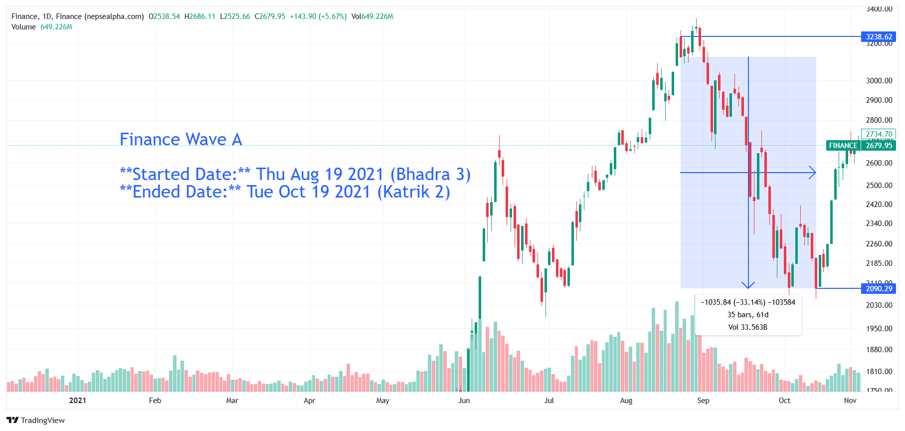

# **Finance Wave A - In-depth Analysis**  

  

**Started Date:** Thu Aug 19, 2021 (Bhadra 3)  
**Ended Date:** Tue Oct 19, 2021 (Kartik 2)  

**Rally Type:** Drop  

- **Total Points Dropped:** -1035  
- **Percentage Drop:** 33.14%  
- **Number of Bars:** 35  
- **Total Days:** 61  
- **Total Volume:** 33.56 B  

---

## Simple Statistics - Finance  

- **Average Volume per Bar:**  
    = 0.96  B  

- **Average Drop per Bar:**  
  = 29.57  points  

- **Recovery Rate After Drawdown:**  
  If the sector drops by 33.14%, the required percentage increase from the bottom to recover fully is:  

  **≈ 49.52%**  

---

## **Finance Wave A - Stock Performance**  

| S.N | Symbol | Close  | Prev Close | % Change | Point Change |
|-----|--------|--------|------------|----------|--------------|
| 1   | ICFC   | 571.43 | 985.71     | -42.03%  | -414.28      |
| 2   | PFL    | 500.00 | 832.69     | -39.95%  | -332.69      |
| 3   | GUFL   | 773.00 | 1282.00    | -39.70%  | -509.00      |
| 4   | CFCL   | 413.18 | 671.31     | -38.45%  | -258.13      |
| 5   | SFCL   | 408.00 | 660.00     | -38.18%  | -252.00      |
| 6   | NFS    | 465.00 | 742.00     | -37.33%  | -277.00      |
| 7   | SIFC   | 408.20 | 615.23     | -33.65%  | -207.03      |
| 8   | RLFL   | 433.80 | 650.70     | -33.33%  | -216.90      |
| 9   | GMFIL  | 406.01 | 606.57     | -33.06%  | -200.56      |
| 10  | BFC    | 387.00 | 576.00     | -32.81%  | -189.00      |
| 11  | GFCL   | 558.20 | 811.18     | -31.19%  | -252.98      |
| 12  | MPFL   | 334.07 | 485.19     | -31.15%  | -151.12      |
| 13  | PROFL  | 338.68 | 478.30     | -29.19%  | -139.62      |
| 14  | JFL    | 469.57 | 645.22     | -27.22%  | -175.65      |
| 15  | MFIL   | 717.50 | 950.00     | -24.47%  | -232.50      |

---

### **Key Takeaways from Finance Sector Decline**  

1. **ICFC, PFL, and GUFL Had the Sharpest Falls**  
   - *ICFC* dropped **-42.03%**, making it the worst-performing finance stock.  

2. **Generalized Weakness Across the Sector**  
   - Every stock declined, indicating that external factors drove the sell-off rather than company-specific issues.  

3. **Massive Recovery Needed**  
   - A **33.14% drawdown** means the sector requires a **49.52% increase** to recover, making a V-shaped recovery challenging.  

---