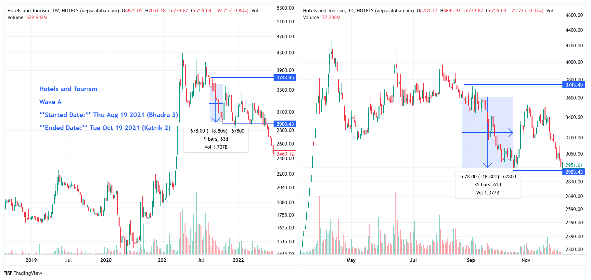

# **Hotels Wave A - In-depth Analysis**  

**Started Date:** Thu Aug 19, 2021 (Bhadra 3)  
**Ended Date:** Tue Oct 19, 2021 (Kartik 2)  

**Rally Type:** Drop  

- **Total Points Dropped:** -678 
- **Percentage Drop:** 18.80%  
- **Number of Bars:** 35  
- **Total Days:** 61  
- **Total Volume:** 1.37 B  

---

## Simple Statistics - Hotels and   

- **Average Volume per Bar:**  
    = 0.04  B  

- **Average Drop per Bar:**  
  = 19.37  points  

- **Recovery Rate After Drawdown:**  
  So, the required percentage increase to recover fully from an 18.80% drop is ≈ 23.16%.

---

## **Hotels Wave A - Stock Performance**  

# Hotels

| SN | Symbol | Close  | Prev Close | % Change | Point Change |
|----|--------|--------|------------|----------|--------------|
| 1  | OHL    | 471    | 621        | -24.15%  | -150         |
| 2  | SHL    | 206.67 | 261.9      | -21.09%  | -55.23       |
| 3  | TRH    | 323.08 | 399.04     | -19.04%  | -75.96       |
| 4  | CGH    | 1266   | 1505       | -15.88%  | -239         |

---

### **Key Takeaways from Hotels Sector Decline**  

1. **OHL and SHL Experienced Significant Declines**  
   - *OHL* dropped **-24.15%**, the highest point change of **-150**, leading the sector's decline.  
   - *SHL* followed with a **-21.09%** decrease, losing **-55.23** points.  

2. **Sector-Wide Weakness**  
   - All stocks in the Hotels sector fell, indicating broader market or policy-driven pressures rather than company-specific issues.  

3. **Steep Recovery Needed**  
   - With declines ranging from **-15.88% to -24.15%**, a full rebound will require substantial investor confidence and time.

---