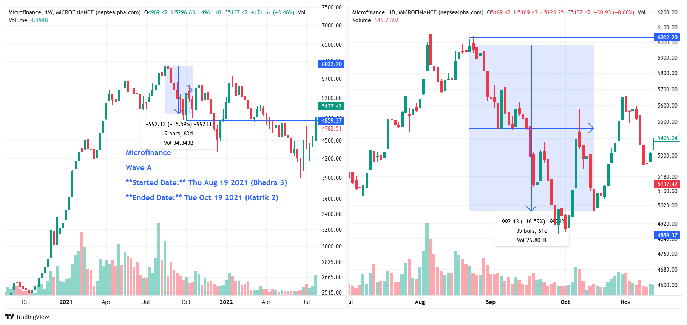

# **Microfinance Wave A - In-depth Analysis**  

**Started Date:** Thu Aug 19, 2021 (Bhadra 3)  
**Ended Date:** Tue Oct 19, 2021 (Kartik 2)  

**Rally Type:** Drop  

- **Total Points Dropped:** -992.13  
- **Percentage Drop:** 16.59%  
- **Number of Bars:** 35  
- **Total Days:** 61  
- **Total Volume:** 26.80 B  

---

## Simple Statistics - Microfinance  

- **Average Volume per Bar:**  
    = 0.77  B  

- **Average Drop per Bar:**  
  = 28.35  points  

- **Recovery Rate After Drawdown:**  
  A 19.89% recovery is needed to fully rebound from a 16.59% drawdown.

---

## **Microfinance Wave A - Stock Performance**  

# Microfinance

| SN  | Symbol   | Close    | Prev Close | % Change | Point Change |
|-----|----------|----------|------------|----------|--------------|
| 1   | FMDBL    | 794.42   | 1200       | -33.80%  | -405.58      |
| 2   | DDBL     | 1101.91  | 1640.91    | -32.85%  | -539         |
| 3   | NICLBSL  | 1097     | 1567       | -29.99%  | -470         |
| 4   | GBLBS    | 938.9    | 1321       | -28.93%  | -382.1       |
| 5   | RSDC     | 742.17   | 1025.69    | -27.64%  | -283.52      |
| 6   | LLBS     | 1513.04  | 2052.17    | -26.27%  | -539.13      |
| 7   | NSLB     | 1142.86  | 1546.22    | -26.09%  | -403.36      |
| 8   | MMFDB    | 1178.05  | 1542.28    | -23.62%  | -364.23      |
| 9   | SMFDB    | 1135.94  | 1474.96    | -22.99%  | -339.02      |
| 10  | SKBBL    | 1461.71  | 1858.21    | -21.34%  | -396.5       |
| 11  | GILB     | 1857.14  | 2357.14    | -21.21%  | -500         |
| 12  | KLBSL    | 1233.64  | 1557.94    | -20.82%  | -324.3       |
| 13  | NMFBS    | 2558.14  | 3214.05    | -20.41%  | -655.91      |
| 14  | GLBSL    | 1440.38  | 1809.62    | -20.40%  | -369.24      |
| 15  | GMFBS    | 1186.64  | 1487.39    | -20.22%  | -300.75      |
| 16  | SWBBL    | 1370.6   | 1717.69    | -20.21%  | -347.09      |
| 17  | SLBSL    | 1131.82  | 1400       | -19.16%  | -268.18      |
| 18  | RMDC     | 1104.76  | 1364.29    | -19.02%  | -259.53      |
| 19  | HLBSL    | 1166.67  | 1435.14    | -18.71%  | -268.47      |
| 20  | NLBBL    | 1086.89  | 1335.25    | -18.60%  | -248.36      |
| 21  | ALBSL    | 1422.05  | 1741.25    | -18.33%  | -319.2       |
| 22  | VLBS     | 1267.5   | 1550       | -18.23%  | -282.5       |
| 23  | NUBL     | 1176.47  | 1436.97    | -18.13%  | -260.5       |
| 24  | ACLBSL   | 1136.36  | 1382.07    | -17.78%  | -245.71      |
| 25  | SMATA    | 1304.28  | 1573.68    | -17.12%  | -269.4       |
| 26  | NMBMF    | 1151.82  | 1389.09    | -17.08%  | -237.27      |
| 27  | KMCDB    | 1024.37  | 1215.97    | -15.76%  | -191.6       |
| 28  | ILBS     | 1348.42  | 1587.5     | -15.06%  | -239.08      |
| 29  | MERO     | 1279.64  | 1492.73    | -14.28%  | -213.09      |
| 30  | USLB     | 1484.62  | 1730       | -14.18%  | -245.38      |
| 31  | FOWAD    | 2120     | 2462.4     | -13.91%  | -342.4       |
| 32  | MSLB     | 1680.53  | 1934.35    | -13.12%  | -253.82      |
| 33  | CBBL     | 1565.71  | 1801.9     | -13.11%  | -236.19      |
| 34  | JSLBB    | 2753.91  | 3117.39    | -11.66%  | -363.48      |
| 35  | MLBBL    | 1693.91  | 1913.91    | -11.49%  | -220         |
| 36  | SLBS     | 1427.5   | 1538.5     | -7.21%   | -111         |
| 37  | SABSL    | 1633.05  | 1758.47    | -7.13%   | -125.42      |
| 38  | SMB      | 2246.02  | 2388.5     | -5.97%   | -142.48      |
| 39  | SLBBL    | 1391.59  | 1435.51    | -3.06%   | -43.92       |
| 40  | MLBSL    | 3274.71  | 3366.1     | -2.72%   | -91.39       |
| 41  | SDLBSL   | 1486.55  | 1524.37    | -2.48%   | -37.82       |
| 42  | SMFBS    | 2173.33  | 2195.83    | -1.02%   | -22.5        |
| 43  | JBLB     | 3710.53  | 3426.4     | 8.29%    | 284.13       |
| 44  | MKLB     | 1599.52  | 351.6      | 354.93%  | 1247.92      |

---

### **Key Takeaways from Microfinance Sector Decline**  

1. **FMDBL, DDBL, and NICLBSL Suffered the Biggest Losses**  
   - *FMDBL* dropped **-33.80%**, leading the sector's decline with the largest point change of **-405.58**.  
   - *DDBL* and *NICLBSL* followed with significant declines of **-32.85%** and **-29.99%**, respectively.  

2. **Sector-Wide Weakness**  
   - Nearly all stocks in the Microfinance sector fell, with only *JBLB* and *MKLB* showing gains. This indicates broader market or policy-driven pressures rather than company-specific issues.  

3. **Steep Recovery Needed**  
   - With many stocks down over **20-30%**, a full rebound will require substantial investor confidence and time. Stocks like *FMDBL* and *DDBL* will need significant recoveries to return to their previous levels.  

4. **Bright Spots in the Sector**  
   - *MKLB* surged by **354.93%**, and *JBLB* gained **8.29%**, showing resilience amidst the overall decline. These outliers suggest potential opportunities for investors in specific stocks.
---