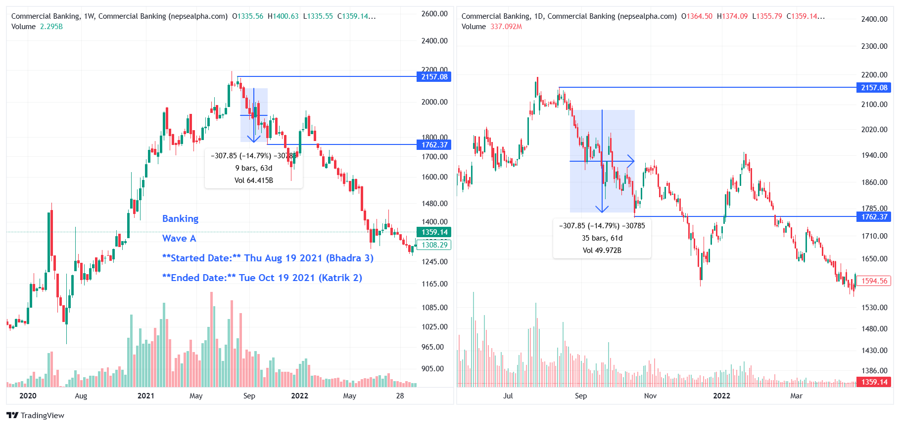

# **Banking Wave A - In-depth Analysis**  

**Started Date:** Thu Aug 19, 2021 (Bhadra 3)  
**Ended Date:** Tue Oct 19, 2021 (Kartik 2)  

**Rally Type:** Drop  

- **Total Points Dropped:** -307.85  
- **Percentage Drop:** 14.79%  
- **Number of Bars:** 35  
- **Total Days:** 61  
- **Total Volume:** 49.972 B  

---

## Simple Statistics - Banking  

- **Average Volume per Bar:**  
    = 1.43  B  

- **Average Drop per Bar:**  
  = 8.80  points  

- **Recovery Rate After Drawdown:**  
  A 17.36% recovery is needed to fully rebound from a 14.79% drawdown.

---

## **Banking Wave A - Stock Performance**  

# Banking

| SN  | Symbol | Close   | Prev Close | % Change | Point Change |
|-----|--------|---------|------------|----------|--------------|
| 1   | CZBIL  | 295     | 419        | -29.59%  | -124         |
| 2   | KBL    | 275     | 380        | -27.63%  | -105         |
| 3   | SBL    | 385.78  | 504.89     | -23.59%  | -119.11      |
| 4   | LBL    | 283.33  | 368.52     | -23.12%  | -85.19       |
| 5   | NCCB   | 271.85  | 349.24     | -22.16%  | -77.39       |
| 6   | GBIME  | 369.31  | 472.77     | -21.88%  | -103.46      |
| 7   | SRBL   | 277.54  | 351.9      | -21.13%  | -74.36       |
| 8   | PRVU   | 348.36  | 438.59     | -20.57%  | -90.23       |
| 9   | NBB    | 345.09  | 433.21     | -20.34%  | -88.12       |
| 10  | BOKL   | 299.06  | 374.53     | -20.15%  | -75.47       |
| 11  | MEGA   | 290     | 362.5      | -20.00%  | -72.5        |
| 12  | CCBL   | 218.52  | 271.41     | -19.49%  | -52.89       |
| 13  | CBL    | 220     | 270.48     | -18.66%  | -50.48       |
| 14  | NICA   | 613.18  | 751.16     | -18.37%  | -137.98      |
| 15  | NBL    | 402.19  | 490.53     | -18.01%  | -88.34       |
| 16  | NMB    | 390     | 468        | -16.67%  | -78          |
| 17  | ADBL   | 483.33  | 578.92     | -16.51%  | -95.59       |
| 18  | SBI    | 327.71  | 386.51     | -15.21%  | -58.8        |
| 19  | MBL    | 321.09  | 377.85     | -15.02%  | -56.76       |
| 20  | PCBL   | 430.67  | 495.67     | -13.11%  | -65          |
| 21  | SCB    | 520     | 577        | -9.88%   | -57          |
| 22  | SANIMA | 449.54  | 491.28     | -8.50%   | -41.74       |
| 23  | EBL    | 633.64  | 690        | -8.17%   | -56.36       |
| 24  | NABIL  | 1431    | 1490       | -3.96%   | -59          |

---

### **Key Takeaways from Banking Sector Decline**    

1. **CZBIL, KBL, and SBL Suffered the Biggest Losses**  
   - *CZBIL* dropped **-29.59%**, leading the sector's decline with the largest point change of **-124**.  

2. **Sector-Wide Weakness**  
   - All stocks in the Banking sector fell, indicating broader market or policy-driven pressures rather than company-specific issues.  

3. **Steep Recovery Needed**  
   - With many stocks down over **20-30%**, a full rebound will require substantial investor confidence and time.
---