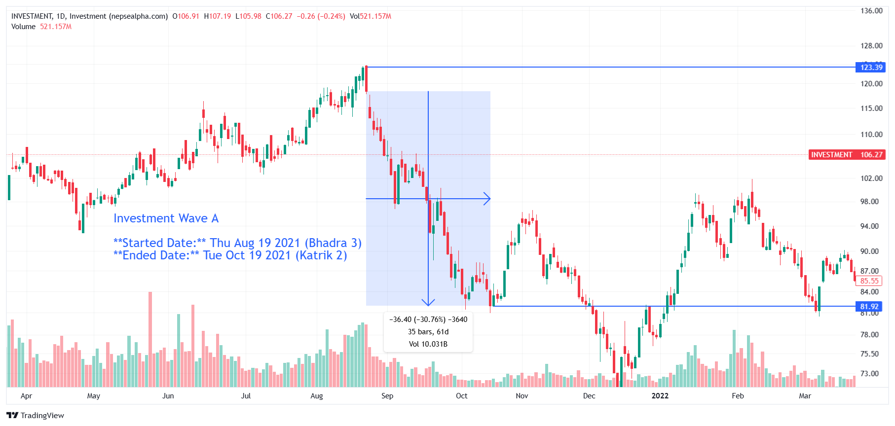

# **Investment Wave A - In-depth Analysis**  

**Started Date:** Thu Aug 19, 2021 (Bhadra 3)  
**Ended Date:** Tue Oct 19, 2021 (Kartik 2)  

**Rally Type:** Drop  

- **Total Points Dropped:** -36.40
- **Percentage Drop:** 30.76%  
- **Number of Bars:** 35  
- **Total Days:** 61  
- **Total Volume:** 10.03 B  

---

## Simple Statistics - Investment  

- **Average Volume per Bar:**  
    = 0.29  B  

- **Average Drop per Bar:**  
  = 1.04  points  

- **Recovery Rate After Drawdown:**  
The sector needs a 44.43% increase to fully recover from a 30.76% drop.

---

## **Investment Wave A - Stock Performance**  

# Investment

## Investment  

| S.N | Symbol | Close  | Prev Close | % Change | Point Change |
|-----|--------|--------|------------|-----------|--------------|
| 1   | HIDCL  | 270.37 | 478.7      | -43.52%   | -208.33      |
| 2   | NRN    | 571    | 965        | -40.83%   | -394         |
| 3   | NIFRA  | 335    | 469        | -28.57%   | -134         |
| 4   | CIT    | 2833.33| 3508.77    | -19.25%   | -675.44      |

---

### **Key Takeaways from Investment Sector Decline**  

1. **HIDCL, NRN, and NIFRA Led the Losses**  
   - *HIDCL* dropped **-43.52%**, making it the worst performer in the sector.  

2. **Broad Weakness Across the Sector**  
   - All investment stocks declined, signaling external market pressures rather than individual company failures.  

3. **Significant Recovery Needed**  
   - With drops ranging from **-19% to -43%**, the sector will need strong catalysts for a turnaround.  

---