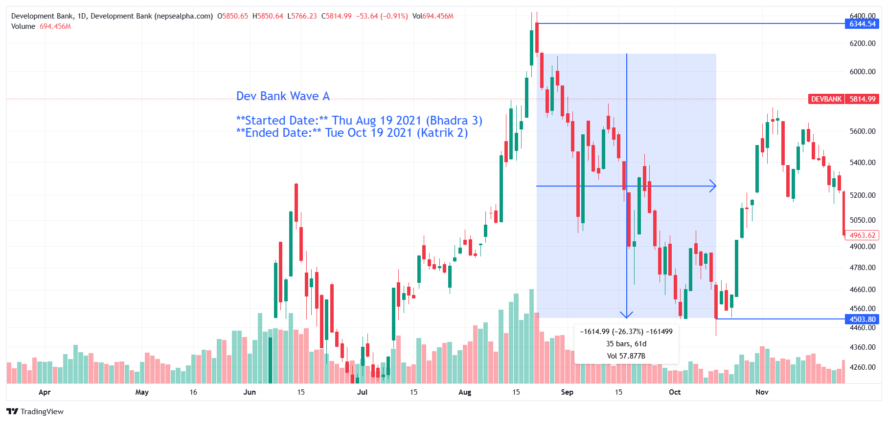

# **Dev Bank Wave A - In-depth Analysis**  

**Started Date:** Thu Aug 19, 2021 (Bhadra 3)  
**Ended Date:** Tue Oct 19, 2021 (Kartik 2)  

**Rally Type:** Drop  

- **Total Points Dropped:** -1614.99  
- **Percentage Drop:** 26.37%  
- **Number of Bars:** 35  
- **Total Days:** 61  
- **Total Volume:** 57.87 B  

---

## Simple Statistics - Dev Bank  

- **Average Volume per Bar:**  
    = 1.65  B  

- **Average Drop per Bar:**  
  = 46.14  points  

- **Recovery Rate After Drawdown:**  
So, after a 26.37% drop, the asset needs a 35.82% increase to fully recover. 🚀

---

## **Dev Bank Wave A - Stock Performance**  

#### Dev Bank

| SN | Symbol  | Close  | Prev Close | % Change | Point Change |
|----|---------|--------|------------|----------|--------------|
| 1  | EDBL    | 488.48 | 1007.56    | -51.52%  | -519.08      |
| 2  | LBBL    | 444.23 | 701.73     | -36.70%  | -257.5       |
| 3  | SADBL   | 341.71 | 538.1      | -36.50%  | -196.39      |
| 4  | SAPDBL  | 329.2  | 496.5      | -33.70%  | -167.3       |
| 5  | MDB     | 507.76 | 726.03     | -30.06%  | -218.27      |
| 6  | SHINE   | 387.33 | 550.23     | -29.61%  | -162.9       |
| 7  | SINDU   | 398    | 562        | -29.18%  | -164         |
| 8  | GRDBL   | 346.82 | 483.62     | -28.29%  | -136.8       |
| 9  | JBBL    | 433.01 | 593.2      | -27.00%  | -160.19      |
| 10 | GBBL    | 478.54 | 643.84     | -25.67%  | -165.3       |
| 11 | NABBC   | 682    | 917        | -25.63%  | -235         |
| 12 | KRBL    | 392    | 527        | -25.62%  | -135         |
| 13 | CORBL   | 713.52 | 952.38     | -25.08%  | -238.86      |
| 14 | KSBBL   | 608.18 | 773.87     | -21.41%  | -165.69      |
| 15 | MLBL    | 556.73 | 699.04     | -20.36%  | -142.31      |
| 16 | MNBBL   | 591.34 | 737.13     | -19.78%  | -145.79      |

---

### **Key Takeaways from Dev Bank Sector Decline**  

1. **EDBL, LBBL, and SADBL Experienced the Largest Drops**  
   - *EDBL* plunged **-51.52%**, leading the sector’s decline.  

2. **Broad-Based Weakness**  
   - Every stock in the sector declined, reflecting systemic market pressures rather than company-specific issues.  

3. **Significant Recovery Required**  
   - With several stocks down **30-50%**, a full rebound will require strong investor confidence and favorable market conditions.