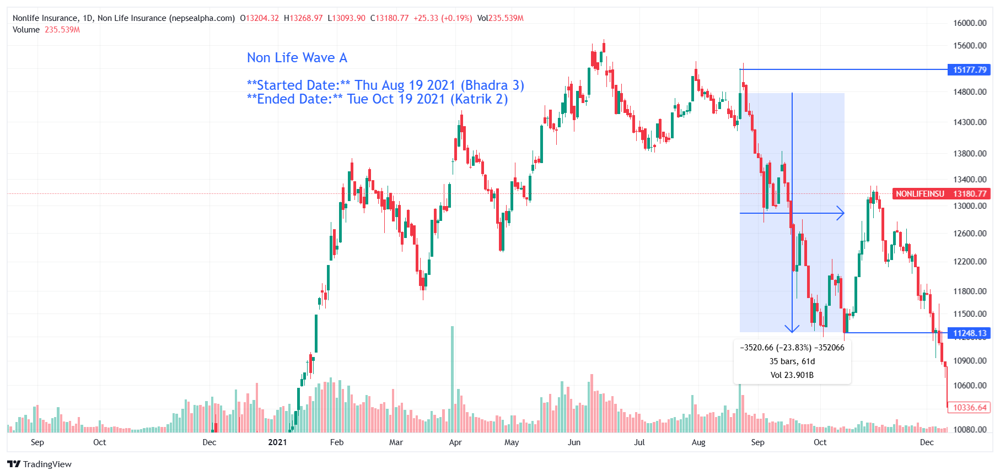

# **Non Life Wave A - In-depth Analysis**  

**Started Date:** Thu Aug 19, 2021 (Bhadra 3)  
**Ended Date:** Tue Oct 19, 2021 (Kartik 2)  

**Rally Type:** Drop  

- **Total Points Dropped:** -3520.66  
- **Percentage Drop:** 23.83%  
- **Number of Bars:** 35  
- **Total Days:** 61  
- **Total Volume:** 23.9 B  

---

## Simple Statistics - Non Life  

- **Average Volume per Bar:**  
    = 0.68  B  

- **Average Drop per Bar:**  
  = 100.59  points  

- **Recovery Rate After Drawdown:**  
So, a 23.83% drawdown requires approximately a 31.29% recovery to break even.

---

## **Non Life Wave A - Stock Performance**  

# Non Life

| SN | Symbol | Close  | Prev Close | % Change | Point Change |
|----|--------|--------|------------|----------|--------------|
| 1  | LGIL   | 574.91 | 872.98     | -34.14%  | -298.07      |
| 2  | UIC    | 530.38 | 784.76     | -32.42%  | -254.38      |
| 3  | HGI    | 562.59 | 820.44     | -31.43%  | -257.85      |
| 4  | GIC    | 520    | 755        | -31.13%  | -235         |
| 5  | SIL    | 800    | 1145       | -30.13%  | -345         |
| 6  | NICL   | 680.91 | 971.82     | -29.93%  | -290.91      |
| 7  | PICL   | 600.15 | 850.71     | -29.45%  | -250.56      |
| 8  | EIC    | 564.15 | 792.45     | -28.81%  | -228.3       |
| 9  | SGI    | 551    | 772        | -28.63%  | -221         |
| 10 | PRIN   | 712.17 | 991.89     | -28.20%  | -279.72      |
| 11 | NLG    | 791.47 | 1090.05    | -27.39%  | -298.58      |
| 12 | PIC    | 831.51 | 1133.48    | -26.64%  | -301.97      |
| 13 | IGI    | 959    | 1283       | -25.25%  | -324         |
| 14 | AIL    | 666.1  | 867        | -23.17%  | -200.9       |
| 15 | NIL    | 1056.52| 1319.13    | -19.91%  | -262.61      |
| 16 | SICL   | 1409.48| 1748.28    | -19.38%  | -338.8       |
| 17 | SIC    | 1089.86| 1327.4     | -17.90%  | -237.54      |
| 18 | RBCL   | 16997  | 20200      | -15.86%  | -3203        |

---

### **Key Takeaways from Non-Life Sector Decline**  

1. **LGIL, UIC, and HGI Suffered the Biggest Losses**  
   - *LGIL* dropped **-34.14%**, leading the sector's decline.  

2. **Sector-Wide Weakness**  
   - Every stock fell, indicating broader market or policy-driven pressures rather than company-specific issues.  

3. **Steep Recovery Needed**  
   - With multiple stocks down **25-35%**, a full rebound will require strong investor confidence and favorable market conditions.

---