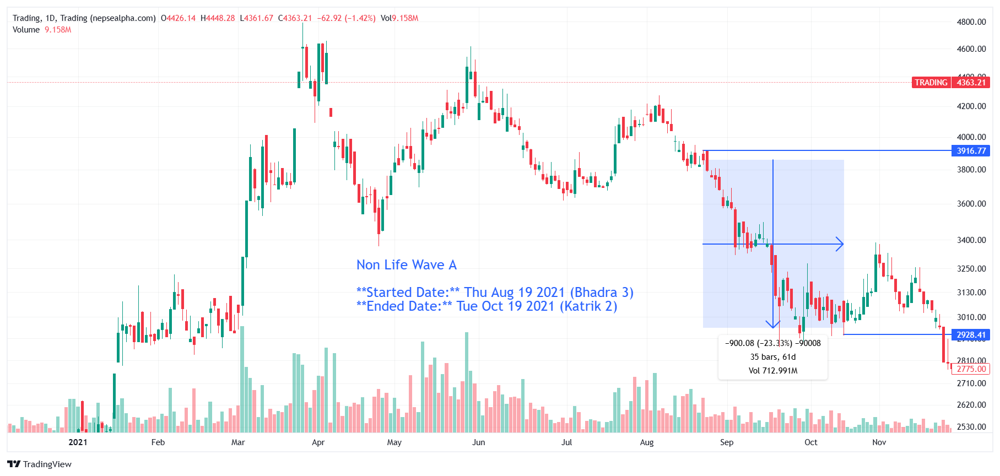

# **Trading Wave A - In-depth Analysis**  

**Started Date:** Thu Aug 19, 2021 (Bhadra 3)  
**Ended Date:** Tue Oct 19, 2021 (Kartik 2)  

**Rally Type:** Drop  

- **Total Points Dropped:** -900  
- **Percentage Drop:** 23.33%  
- **Number of Bars:** 35  
- **Total Days:** 61  
- **Total Volume:** 712.99 M  

---

## Simple Statistics - Trading  

- **Average Volume per Bar:**  
    = 20.37  M  

- **Average Drop per Bar:**  
  = 25.71  points  

- **Recovery Rate After Drawdown:**  
   So, a 30.42% increase is needed to recover from a 23.33% drawdown.
---

## **Trading Wave A - Stock Performance**  

### Trading

| SN | Symbol | Close  | Prev Close | % Change | Point Change |
|----|--------|--------|------------|-----------|--------------|
| 1  | STC    | 5630.43 | 8678.26    | -35.12%   | -3047.83     |
| 2  | BBC    | 5000    | 6680       | -25.15%   | -1680        |

---

### **Key Takeaways from Trading Sector Decline**  

1. **STC Experienced the Largest Drop**  
   - *STC* fell **-35.12%**, leading the sector's decline.  

2. **Broad Sector Weakness**  
   - Both stocks in the sector declined, suggesting external market or economic pressures rather than company-specific issues.  

3. **Significant Recovery Required**  
   - With losses exceeding **25-35%**, a full recovery will demand strong investor confidence and favorable market conditions.
---