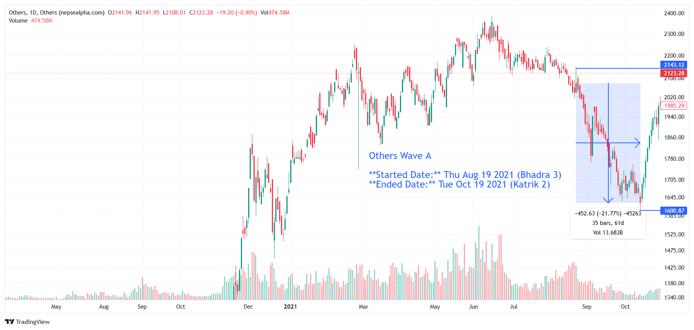

# **Others Wave A - In-depth Analysis**  

**Started Date:** Thu Aug 19, 2021 (Bhadra 3)  
**Ended Date:** Tue Oct 19, 2021 (Kartik 2)  

**Rally Type:** Drop  

- **Total Points Dropped:** -452  
- **Percentage Drop:** 21.77%  
- **Number of Bars:** 35  
- **Total Days:** 61  
- **Total Volume:** 13.68 B  

---

## Simple Statistics - Others  

- **Average Volume per Bar:**  
    = 0.39  B  

- **Average Drop per Bar:**  
  = 12.91  points  

- **Recovery Rate After Drawdown:**  
  You need a 27.87% gain to recover from a 21.77% drawdown. 📈

---

## **Others Wave A - Stock Performance**  

# Others 

| **SN** | **Symbol** | **Close** | **Prev Close** | **% Change** | **Point Change** |
|----|--------|---------|------------|------------|--------------|
| 1  | NRIC   | 1162.77  | 1532.22    | -24.11%   | -369.45      |
| 2  | NTC    | 829.17   | 1033.33    | -19.76%   | -204.16      |

---

### **Key Takeaways from Others Sector Decline**  

1. **NRIC and NTC Faced Significant Losses**  
   - *NRIC* dropped **-24.11%**, leading the sector's decline.  

2. **Sector-Wide Weakness**  
   - Both stocks in the category saw a decline, indicating broader market pressure rather than company-specific issues.  

3. **Recovery Challenge**  
   - With NRIC and NTC down nearly **20-25%**, a full rebound will require strong market sentiment and investor confidence.

---