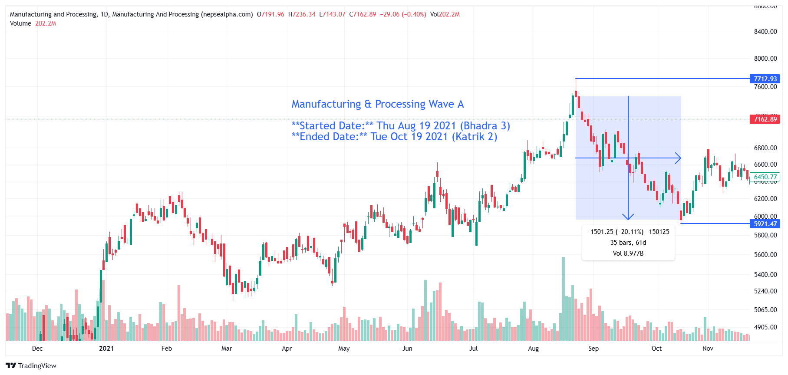

# **Manufacture Wave A - In-depth Analysis**  

**Started Date:** Thu Aug 19, 2021 (Bhadra 3)  
**Ended Date:** Tue Oct 19, 2021 (Kartik 2)  

**Rally Type:** Drop  

- **Total Points Dropped:** -1501.25
- **Percentage Drop:** 20.11%
- **Number of Bars:** 35  
- **Total Days:** 61  
- **Total Volume:** 8.97 B

---

## Simple Statistics - Manufacture  

- **Average Volume per Bar:**  
    = 0.26 B

- **Average Drop per Bar:**  
  = 42.89  points  

- **Recovery Rate After Drawdown:**  
  This means that after a 20.11% loss, the asset must gain 25.17% to return to its original value

---

## **Manufacture Wave A - Stock Performance**  

# Manufacturing  

| SN | Symbol | Close  | Prev Close | % Change | Point Change |
|----|--------|--------|------------|----------|--------------|
| 1  | SHIVM  | 1059.08 | 1575.49    | -32.78%  | -516.41      |
| 2  | HDL    | 5931.82 | 6800       | -12.77%  | -868.18      |
| 3  | BNT    | 9890    | 10800      | -8.43%   | -910         |
| 4  | UNL    | 18798   | 19960      | -5.82%   | -1162        |

---

### **Key Takeaways from Manufacture Sector Decline**  

1. **SHIVM Takes the Biggest Hit**  
   - *SHIVM* dropped **-32.78%**, marking the steepest decline in the sector.  

2. **Sector-Wide Weakness**  
   - Every stock in the manufacturing sector saw losses, suggesting broader market pressure rather than company-specific challenges.  

3. **Recovery Challenges Ahead**  
   - With *SHIVM* down over **32%** and *HDL* facing a **12.77%** decline, substantial investor confidence and time will be needed for a full rebound.  

---