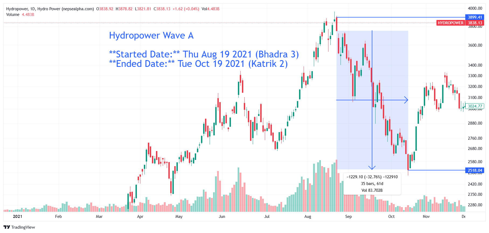

# **Hydropower Wave A - In-depth Analysis**  

**Started Date:** Thu Aug 19, 2021 (Bhadra 3)  
**Ended Date:** Tue Oct 19, 2021 (Kartik 2)  

**Rally Type:** Drop  

- **Total Points Dropped:** -1229  
- **Percentage Drop:** 32.76%  
- **Number of Bars:** 35  
- **Total Days:** 61  
- **Total Volume:** 83.7 B  

---

## Simple Statistics - Hydropower  

- **Average Volume per Bar:**  
    = 0.96  B  

- **Average Drop per Bar:**  
  = 29.57  points  

- **Recovery Rate After Drawdown:**  
  If the sector drops by 33.14%, the required percentage increase from the bottom to recover fully is:  

  **≈ 49.52%**  

---

## **Hydropower Wave A - Stock Performance**  

# Hydropower

| S.N | Symbol | Close | Prev Close | % Change | Point Change |
|----|--------|--------|------------|-----------|--------------|
| 1  | NGPL   | 546.16 | 1093.08    | -50.03%   | -546.92      |
| 2  | NHDL   | 362.62 | 710.28     | -48.95%   | -347.66      |
| 3  | UPCL   | 274.53 | 529.71     | -48.17%   | -255.18      |
| 4  | MHNL   | 330    | 629        | -47.54%   | -299         |
| 5  | RURU   | 881.82 | 1648.18    | -46.50%   | -766.36      |
| 6  | UNHPL  | 289    | 527        | -45.16%   | -238         |
| 7  | SPDL   | 275.33 | 498        | -44.71%   | -222.67      |
| 8  | HPPL   | 380    | 681        | -44.20%   | -301         |
| 9  | SHPC   | 323.64 | 570        | -43.22%   | -246.36      |
| 10 | RHPC   | 589    | 1037       | -43.20%   | -448         |
| 11 | AHPC   | 227.05 | 398.5      | -43.02%   | -171.45      |
| 12 | RADHI  | 490.69 | 853.46     | -42.51%   | -362.77      |
| 13 | AKPL   | 270    | 465.25     | -41.97%   | -195.25      |
| 14 | BARUN  | 232    | 398        | -41.71%   | -166         |
| 15 | UMRH   | 419.62 | 691.94     | -39.36%   | -272.32      |
| 16 | PPCL   | 357.7  | 578        | -38.11%   | -220.3       |
| 17 | LEC    | 297    | 479        | -38.00%   | -182         |
| 18 | SSHL   | 295    | 474        | -37.76%   | -179         |
| 19 | KPCL   | 452.73 | 722.73     | -37.36%   | -270         |
| 20 | GLH    | 379    | 598.1      | -36.63%   | -219.1       |
| 21 | CHL    | 407    | 640        | -36.41%   | -233         |
| 22 | JOSHI  | 286    | 448        | -36.16%   | -162         |
| 23 | PMHPL  | 269    | 418.5      | -35.72%   | -149.5       |
| 24 | UMHL   | 340.19 | 525.23     | -35.23%   | -185.04      |
| 25 | KKHC   | 288    | 441        | -34.69%   | -153         |
| 26 | API    | 309.29 | 467.07     | -33.78%   | -157.78      |
| 27 | RHPL   | 328.5  | 490.5      | -33.03%   | -162         |
| 28 | DHPL   | 275    | 409        | -32.76%   | -134         |
| 29 | SHEL   | 241    | 356        | -32.30%   | -115         |
| 30 | SJCL   | 330    | 482        | -31.54%   | -152         |
| 31 | AKJCL  | 168.8  | 242        | -30.25%   | -73.2        |
| 32 | HURJA  | 241.5  | 343.95     | -29.79%   | -102.45      |
| 33 | RRHP   | 459    | 645        | -28.84%   | -186         |
| 34 | HDHPC  | 198.86 | 277.03     | -28.22%   | -78.17       |
| 35 | NHPC   | 256    | 354        | -27.68%   | -98          |
| 36 | GHL    | 164.67 | 225        | -26.81%   | -60.33       |
| 37 | UPPER  | 329    | 444        | -25.90%   | -115         |
| 38 | BPCL   | 440.95 | 588.57     | -25.08%   | -147.62      |
| 39 | MEN    | 946.35 | 1235.65    | -23.41%   | -289.3       |
| 40 | CHCL   | 501.82 | 636.64     | -21.18%   | -134.82      |

---

### **Key Takeaways from Hydropower Sector Decline**  

1. **NGPL, NHDL, and UPCL Suffered the Biggest Losses**  
   - *NGPL* dropped **-50.03%**, leading the sector's decline.  

2. **Sector-Wide Weakness**  
   - Every stock fell, indicating broader market or policy-driven pressures rather than company-specific issues.  

3. **Steep Recovery Needed**  
   - With many stocks down over **30-50%**, a full rebound will require substantial investor confidence and time.

---